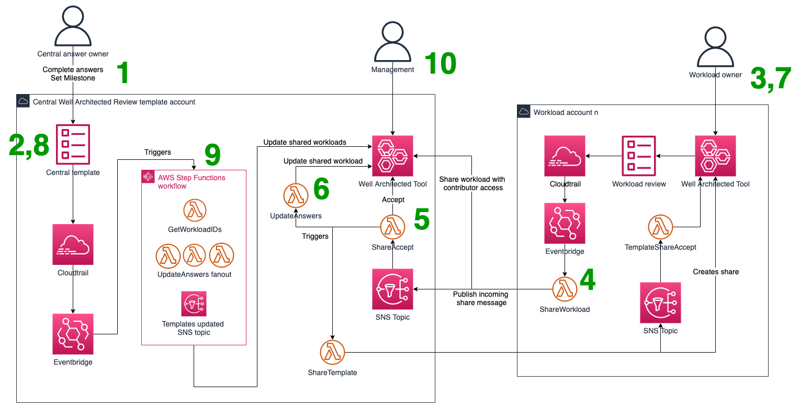

# AWS-Well-Architected-Tool-Template-Automation

## Here for the first time?

In October 2023, AWS released [Well-Architected Templates](https://aws.amazon.com/about-aws/whats-new/2023/10/reduce-duplication-well-architected-templates/) as a service feature which provides much of the functionality and features of this project and more. If you are looking at using Well-Architected Templates in your org, we strongly suggest you use the in-built service feature rather than this project. This project will remain for customers that may have adopted it before the launch of the service feature.

You can read more about using AWS Well-Architected Templates at the [AWS docs](https://docs.aws.amazon.com/wellarchitected/latest/userguide/review-templates.html).

## Overview

This sample provides a way for customers with distributed development teams to maintain consistency with Well-Architected Review answers.

Many customers centralise aspects of their platform, security, operations and financial operations. However, how these capabilities are implemented within an environment can be tricky to communicate to individual development teams. When conducting an AWS Well Architected Review, it can be difficult to know where the boundary lays between a best practice being provided as a service from another team, or whether it is the development teams responsibility themselves to implement. Traditionally, Well-Architected Reviews would involve individuals from all involved teams. This does not always scale in larger enterprises with all involved teams being difficult to identify and locate.

This solution allows central, service providing, best practice owners, to define templated answers in the AWS Well Architected tool. These answers are then replicated to each individual workload review.

## Prerequisites

This solution requires you are already using [AWS Organizations](https://aws.amazon.com/organizations/) to manage your multi-account AWS environment. If you have not previously setup AWS Organizations, please review the [getting started documentation](https://docs.aws.amazon.com/organizations/latest/userguide/orgs_getting-started.html). You will need your AWS Organizations ID to use as input parameters for the CloudFormation templates.

## Getting Started

The solution is deployed using two [AWS CloudFormation](https://aws.amazon.com/cloudformation/) stacks.
`WAFR-Central.yaml` should be deployed to an AWS account you designate as holding the Well Architected answer templates.
`WAFR-Workload.yaml` should be deployed into your workload accounts, potentially as part of an account setup solution.

These templates should be deployed using either the [AWS CLI](https://aws.amazon.com/cli/) or [rain](https://aws-cloudformation.github.io/rain/rain_deploy.html) as described in this readme. Attempting to deploy the templates via the CloudFormation console will result in errors as the Lambda function code first requires packaging.

### Template Options

When deploying the solution, you can choose between overwriting workload answers with answers provided in the template, or appending templated answers to individual workloads. Appending answers is the default behaviour.

#### WAFR-Central.yaml template
* **OrganizationID** Your AWS Organizations ID, example: `o-ab12cdefgh`
* **TemplatePrefix** The prefix used to identify a Well Architected Tool Workload acting as a template. Example & default: `CentralTemplate`

#### WAFR-Workload.yaml template
* **OrganizationID** Your AWS Organizations ID, example: `o-ab12cdefgh`
* **TemplateAccountID** Account ID of the account hosting the template workloads, example: `111122223333`
* **AWSTeamAccountID** (optional but empty string must be passed if not used) Account ID of your AWS Account Team Well Architected sharing account. This is useful if you are working with an AWS Solutions Architect or Technical Account Manager for providing workload visibility. Please speak to your account team for more information. Example: `444455556666`
* **WAFRNewWorkloadShareTopicARN** This is output from the WellArchitectedTemplateAutomationCentral template. Example: `arn:aws:sns:eu-west-1:111122223333:WAFRNewWorkloadShareTopic`

### WAFR-Central Template Outputs

The WAFR-Central CloudFormation template outputs two SNS topic ARNs.
* WAFRNewWorkloadShareTopicARN
  * This is used for workload accounts to tell the template account a new workload has been shared and needs to be accepted. This value must be used as an input parameter for each workload stack deployment.
* WAFRTemplateUpdateNotificationTopicARN
  * This topic is created on your behalf but its use is optional. A message will be placed onto this topic when a milestone has been created on a template, and those changes have been propagated to all shared workloads. This topic can be used to notify workload owners that an update to a template has occurred and that a review of the changes and how it affects their own workloads reviews should likely occur.

## How it works
The solution operates as follows:
1.	A central team logs into the designated “central template” AWS account. They create a new workload in the AWS WA Tool. The name of the workload must begin with “CentralTemplate” (or any other unique string of your choosing).
1.	The central team answers their questions appropriate to their responsibility, and marks all others as “Question does not apply to this workload”
1.	When an application team is ready to perform an AWS WA framework review, they open the AWS WA Tool in their own AWS account and create a new workload
1.	The workload creation triggers an AWS Lambda function. This shares the workload with the central account (with contributor access), and publishes a message to an Amazon Simple Notification Service (Amazon SNS) topic in the central account
1.	In the central account, a Lambda function is subscribed to the Amazon SNS topic from step 4. The Lambda function accepts the incoming share, then shares all templates back to the workload account (with read-only access). It posts a message to an Amazon SNS topic in the workload account, which triggers the acceptance of the incoming share(s).
1.	The Lambda function in step 5 then triggers a second Lambda function to perform the update. It loops through all workloads with names beginning with “CentralTemplate.” For each template, it reads the selected choices for each question, as well as the notes. Then, it writes them to the newly created workload from step 3. Questions in the template marked as “question does not apply to this workload” are ignored.
1.	The application team completes their AWS WA framework review as usual. As they proceed through the questions, they will see the pre-populated answers from the template.
1.	Should a central team need to update their answers, they can simply update their template. When they are finished, they should create a milestone.
1.	The milestone creation triggers an AWS Step Functions workflow. The workflow first calls a Lambda function to collect the workload IDs of all application workloads currently shared with the central account. Next, it calls a fan-out Lambda execution to update all application workloads based on the current answers in the templates. There is an option (specified at deployment time) to control whether this process should overwrite any existing answers or not.
1.	As all workloads are now visible in the central account, the dashboards referenced in AWS WA labs can be used to further examine them and derive insights on common issues.



## How to deploy

This sample has been provided in raw CloudFormation to remain flexible for differing deployment mechanisms across customers. This documentation provides two ways to deploy the templates, however these are not the only way to deploy. The workload template could be part of an [AWS Service Catalogue](https://docs.aws.amazon.com/servicecatalog/latest/adminguide/introduction.html) product for example and vended into workload account on a self-service basis.

### Option 1 - CloudFormation package & deploy

Using CloudFormation to deploy, you will need an S3 bucket the role you are using to deploy has appropriate permissions to access. This bucket holds the Lambda code artifacts for use in the CloudFormation template. The Lambda artifacts can be packaged and uploaded to your S3 bucket using [`cloudformation package`](https://docs.aws.amazon.com/AWSCloudFormation/latest/UserGuide/using-cfn-cli-package.html).

The `cloudformation package` commands in this readme expect an S3 bucket in each account you are deploying the workload to. You *could* [package](https://docs.aws.amazon.com/lambda/latest/dg/gettingstarted-package.html) and store the Lambda assets to a bucket in a single account, just ensure to update the `Code` [property](https://docs.aws.amazon.com/AWSCloudFormation/latest/UserGuide/aws-properties-lambda-function-code.html#S3Bucket) in the CloudFormation templates to reflect the location of the packaged Lambda code.

The [AWS CLI must be installed](https://docs.aws.amazon.com/cli/latest/userguide/getting-started-install.html) to deploy via CloudFormation.

#### WAFR-Central template with CloudFormation package & deploy

From the repository root, run:
```sh
aws cloudformation package \
  --template-file WAFR-Central.yaml \
  --output-template-file WAFR-Central.packaged.yaml \
  --s3-bucket {your-bucket}

aws cloudformation deploy \
  --template-file WAFR-Central.packaged.yaml \
  --stack-name WAFR-Central \
  --parameter-overrides \
      OrganizationID={your-organizationID} \
      TemplatePrefix='CentralTemplate' \
  --capabilities CAPABILITY_IAM
```

#### WAFR-Workload template with CloudFormation package & deploy

From the repository root, run:
```sh
aws cloudformation package \
  --template-file WAFR-Workload.yaml \
  --output-template-file WAFR-Workload.packaged.yaml \
  --s3-bucket {your-bucket}

aws cloudformation deploy \
  --template-file WAFR-Workload.packaged.yaml \
  --stack-name WAFR-Workload \
  --parameter-overrides \
      OrganizationID={your-organizationID} \
      TemplateAccountID='111122223333' \
      AWSTeamAccountID='444455556666' \
      WAFRNewWorkloadShareTopicARN='arn:aws:sns:eu-west-1:111122223333:WAFRNewWorkloadShareTopic' \
  --capabilities CAPABILITY_IAM
```

`WAFRNewWorkloadShareTopicARN` is required as a parameter for every workload account stack. This can be retrieved from the CloudFormation console in the template account account (where WAFR-Central) is deployed, or by running the following command in the template account.

```sh
aws cloudformation describe-stacks --stack-name WAFR-Central --query "Stacks[0].Outputs[?OutputKey=='WAFRNewWorkloadShareTopicARN'].OutputValue" --output text
```

`AWSTeamAccountID` must be passed as a parameter even if you are not sharing your workload reviews with your AWS account team. If you are not sharing your workloads with AWS, please use `AWSTeamAccountID=''`


### Option 2 - Rain

Using [rain](https://aws-cloudformation.github.io/rain/rain_deploy.html) simplifies the deployment of the templates into your accounts by abstracting the packaging and uploading of the Lambda artifacts. Rain will automatically create a bucket and package the assets for you in the account you are deploying the template to.

#### WAFR-Central template with Rain

To deploy the central account CloudFormation template with rain, ensure your session credentials are setup for the correct account and run from the repository root:

`rain deploy WAFR-Central.yaml`

Rain will then ask for the parameter inputs described above, package the lambda functions and deploy the stack to the account.

#### WAFR-Workload template with Rain

To deploy the workload account CloudFormation template with rain, ensure your session credentials are setup for the correct account and run from the repository root:

`rain deploy WAFR-Workload.yaml`

Rain will then ask for the parameter inputs described above, package the lambda functions and deploy the stack to the account.

## Resource tags

We have not included any resource tags as part of the solution stacks. Tags can be added according to your standards following the usual methods for applying tags within CloudFormation templates.
Syntax for adding tags can be found at the corresponding resource CloudFormation documentation pages such as:
* [Lambda](https://docs.aws.amazon.com/AWSCloudFormation/latest/UserGuide/aws-resource-lambda-function.html)
* [StepFunctions](https://docs.aws.amazon.com/AWSCloudFormation/latest/UserGuide/aws-resource-stepfunctions-statemachine.html)
* [SNS Topic](https://docs.aws.amazon.com/AWSCloudFormation/latest/UserGuide/aws-properties-sns-topic.html)


## Solution cost

The overall cost of this solution is very low given its serverless architecture.
There is no charge for the AWS Well-Architected Tool.

Charges *may* be incurred for these components if outside of free tier:

* [AWS Step Functions](https://aws.amazon.com/step-functions/pricing/)
* [AWS Lambda](https://aws.amazon.com/lambda/pricing/)
* [AWS SNS](https://aws.amazon.com/sns/pricing/)
* [Amazon EventBridge](https://aws.amazon.com/eventbridge/pricing/)

[AWS CloudTrail](https://aws.amazon.com/cloudtrail/pricing/) usage is within free tier.

## FAQ

* Can we automate sharing workloads to an aws-owned account for account team visibility?
    * Yes, where your AWS account team has provisioned an account to share, this account ID can be provided in the WAFR-Workload template.


* What happens if something is decentralised? eg. an organisational change means that the answer to SEC10 now resides with application teams, rather than the security team
    * Security team should change the answer to “none of these” then save a milestone, causing HRIs in every application workload.
    * Security team should then select “question does not apply to this workload” to bring that question out of scope. There is no need to save another milestone.


* What if a question is partially owned by a central team, and partially by an application team?
    * The central team should mark the best practices within the question and complete the notes section to reflect the shared responsibility of the question.


* What if a best practice is a shared responsibility between the central team and application team?
  * The central team should leave the best practice unmarked and use the notes section to define the position.


* Once the review is completed, how can an application team identify the answers that came from central templates vs their own answers, for example when performing a subsequent review?
    * The notes section in questions populated from the "central" templates includes a delimiter to this effect.


* What if an application team selects additional best practices in a question owned by a central team?
    * These selections will be overwritten the next time *any* central team creates a milestone


* What if there’s a mismatch in lenses between central and application workloads?
    * The decision as to which lenses should apply to a workload should be made exclusively by the application team, so lenses will not be added or removed in application workloads. If there are central answers for any of the lenses selected by an application team, they will be propagated.
